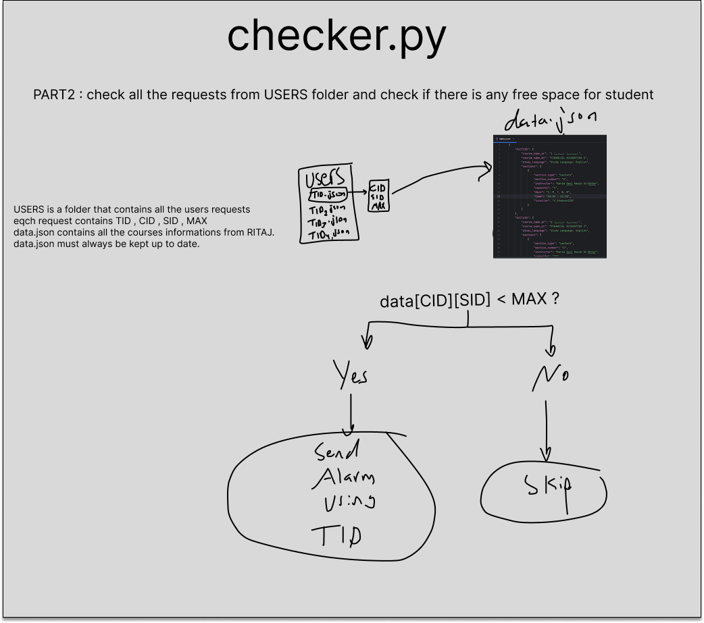

# RitajCourseWatcher_v2

A simple Telegram bot that helps **Birzeit University students** monitor course section availability on **RITAJ BIerziet University**.  
Students receive an **instant Telegram notification** when a seat becomes available in their chosen section.

---

## 🚀 Features

✅ Students send their request using Telegram  
✅ Bot saves each request in `USERS/` as `<TID>.json`  
✅ Background checker continuously monitors course data from `data.json`  
✅ If `current_capacity < MAX`, the student receives an alert  
✅ Request is deleted after a successful notification

---

## 📂 Project Structure

```
RitajCourseWatcher_v2
│── receiver.py     # Handles Telegram user input & saves requests
│── scraping.py     # Update the data.json directly using the link from Ritaj
│── checker.py      # Checks availability & sends alerts
│── data.json       # Latest RITAJ course data (must be updated regularly)
│── USERS/          # Stores pending user requests as JSON files
│── config.py       # Contains TELEGRAM_API_TOKEN & CHECK_EVERY
│── README.md
``

---

## ⚙️ Setup & Usage

1. **Install Requirements**

```bash
pip install python-telegram-bot
```

2. **Add Your Telegram Bot Token**

Create `config.py`:

```python
TELEGRAM_API_TOKEN = "YOUR_BOT_TOKEN"
CHECK_EVERY = 60  # seconds
```

3. **Run the Receiver (User Input Bot)**

```bash
python receiver.py
```

4. **Run the Checker (Background Alerts)**

```bash
python checker.py
```

---

## ✅ Example Alert

```
📢 تنبيه
شعبة ENCS3320
يوجد فيها 29 والعدد الاقصى هو 30
سارع بالتسجيل
```

---

## 📌 Notes

- Don’t worry — this project won’t spam Ritaj. It makes only one request every set period of time. 
- Make sure `data.json` is **always up to date** with RITAJ course data.
- I can’t share the main courses link or scraping code — but you can ask Ritaj Computer Center for the link.
- Each file in `USERS/` represents **one active watch request**.
- Once a notification is sent, the file is **automatically removed**.

---

## 🤝 Contributions

Improvements are welcome!

Follow the quick instructions provided in the link below.
https://www.figma.com/design/ZVJiHDJlFJwojodghAHXWa/Untitled?node-id=11-258&t=lC1iQbQV63o2WvjV-1



